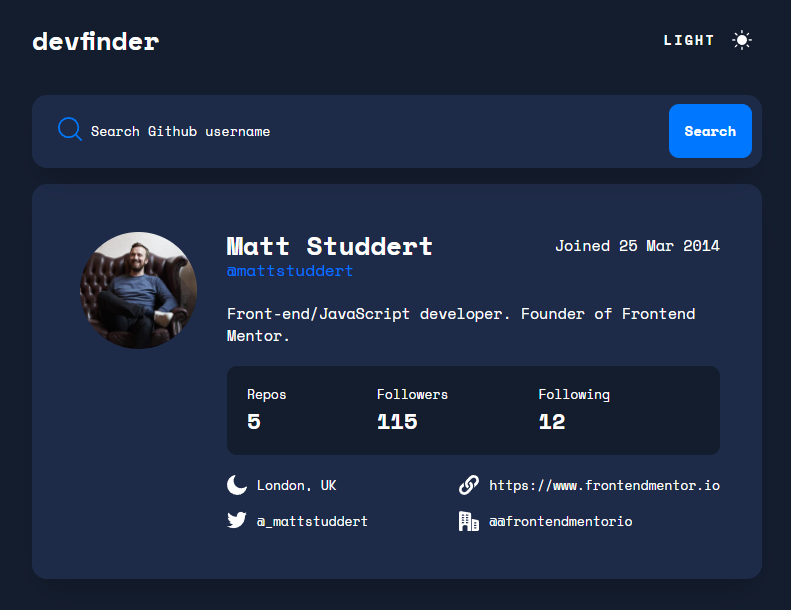
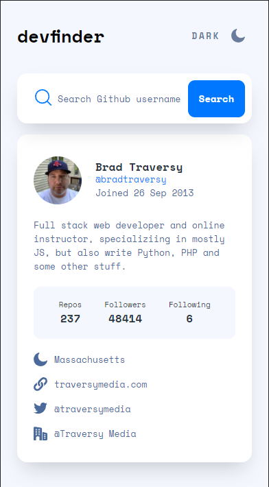

# Frontend Mentor - Github Users Search

## Table of contents

- [Overview](#overview)
  - [The challenge](#the-challenge)
  - [Screenshot](#screenshot)
  - [Links](#links)
- [My process](#my-process)
  - [Built with](#built-with)
  - [What I learned](#what-i-learned)
- [Author](#author)

## Overview

### Screenshot

### Links

- Solution URL: [https://github.com/Kijimai/fem-github-search](https://github.com/Kijimai/fem-github-search)
- Live Site URL: [https://github-user-searcher-kijimai.netlify.app/](https://github-user-searcher-kijimai.netlify.app/)

## My process

### Built with

- Semantic HTML5 markup
- SCSS
- Flexbox
- Grid
- Mobile-first workflow
- Axios
- [React](https://reactjs.org/) - JS library

### What I learned

Learned more about the flexibility of scss and react when combined together. It really does shorten most of my work and I'm still always looking for ways to optimize the code necessary to reach the same goal. For example: storing state and using state to show or hide certain components and elements into and away from the view.

## Author

- Website - [JibbyCodes](https://jdbucog.com/)
- Frontend Mentor - [@Kijimai](https://www.frontendmentor.io/profile/Kijimai)

